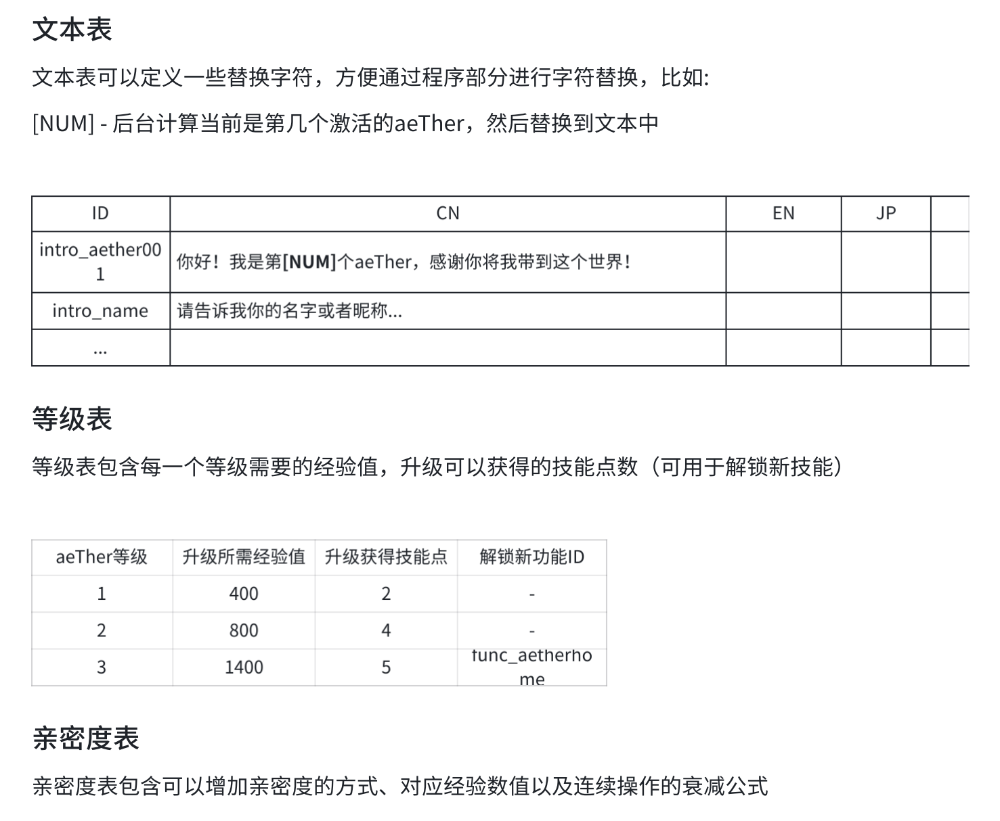

# aeTher接口文档

### 登录

这个接口用于处理登录请求

##### 请求地址
POST /api/login
##### 请求参数
```json
{
  username: "admin",
  password: "123456"
}
```

##### 成功响应

第一次登录时返回信息
```json
{
    msg: "登录成功",
    token:dasdhaskjdhaxbak, //登录成功后返回的token,之后的请求头部的Authorization都需要带上这个token
    isFirstLogin: true, //是否第一次登录
    //aeTher的初始化输出信息
    aeTherText:["我是aeTHer001"，...]
    提示信息，这里需要后台定义
}

```
记得创建这些表

以前登录过时返回信息

```json
{
    msg: "登录成功",
    token:dasdhaskjdhaxbak, 
    isFirstLogin: false, 
    aeTher:{
    //aeTher的初始化输出信息
    aeTherText:["我是aeTHer001"，...]
    /*
    这里返回是注册流程为空的第一个值，用于处理用户注册到一半时退出的情况。
    注册分多次请求 userFullName,aeTherName,aeTherSex, characterTestForm(前三项均为字符串，最后一项为对象，用于存储提交的表单数据，具体内容在aeTher初始化)。
    空串代表已经初始化完成，正式进入页面。
    */
    aeTherState:"aeTherName"
    //以下内容只有aeTherState为空串后才有
    aeTherName: "myLoveAeTher",
    aeTherSex: "男",
    avatarUrl: "https://aether.oss-cn-beijing.aliyuncs.com/avatar/default.jpg",
    level: 1,
    relationshipTitle: "关系称号",
    //升级所需经验
    expToLevelUp: 100,

    }
    

    //以下内容只有aeTherState为空串后才有
    user:{
        //用户名称，货币等其他信息demo不需要
        userFullName: "陈凯",
    }
    
}
```
##### 失败响应
```json
{
    msg: "登录失败"
}
```

### aeTher初始化

这个接口用于处理aeTher初始化请求

##### 请求地址
GET /api/aeTherInit
POST /api/aeTherInit

##### 请求参数
所有的请求都记得解析token比对，token不对则返回
msg: "请先登录"
注意，这里是按顺序依次多次请求，这样可以避免用户注册到一半时退出的情况。
以下三个请求均为POST，后端需要存储字段
```json
{
  userFullName: "陈凯",
  username: "admin",
}
```
```json
{
  aeTherName: "myLoveAeTher",
  username: "admin",
}
```
```json
{
  aeTherSex: "man",
  username: "admin",
}
```
##### GET成功响应
get请求时返回的是表格数据
```json
{
//通过量表完成性格特征雷达图，完成之后会⾃动⽣成新的形象
  characterTestForm: {
    "test_name": "简易性格测试", // 测试名称
    "questions": [ // 测试问题列表
        {
        "question_id": 1, // 问题编号
        "question_text": "你更喜欢独自一人还是与他人一起活动？", // 问题内容
        "options": [ // 选项列表
            {
            "option_id": 1, // 选项编号
            "option_text": "独自一人", // 选项内容
            "score": 2 // 选项得分，这里可以根据回答情况调整分值
            },
            {
            "option_id": 2,
            "option_text": "与他人一起活动",
            "score": 5
            }
        ]
        },
        {
        "question_id": 2,
        "question_text": "你更喜欢计划好每一步，还是随心所欲地行动？",
        "options": [
            {
            "option_id": 1,
            "option_text": "计划好每一步",
            "score": 5
            },
            {
            "option_id": 2,
            "option_text": "随心所欲地行动",
            "score": 2
            }
        ]
        },
        {
        "question_id": 3,
        "question_text": "在压力下，你更倾向于如何应对？",
        "options": [
            {
            "option_id": 1,
            "option_text": "冷静分析并寻求解决方案",
            "score": 5
            },
            {
            "option_id": 2,
            "option_text": "情绪化或逃避",
            "score": 2
            }
        ]
        }
    ]
}

}
```
##### POST成功响应
```json
{
    msg: "初始化成功",
}
```
##### GET和POST失败响应
```json
{
    //根据情况不同可分为，其中msg需要返回具体失败相应的原因。
    msg: "初始化失败"/"表格信息不存在"...,
    
}
```
